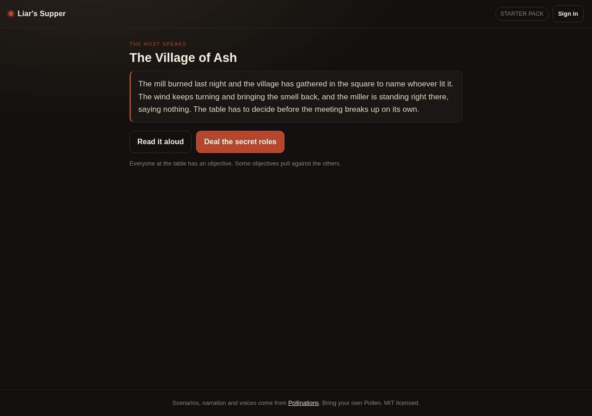
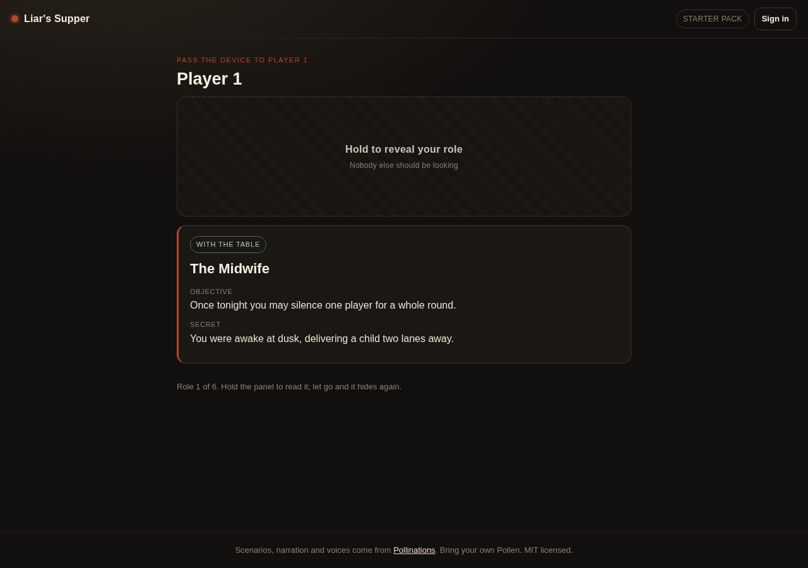
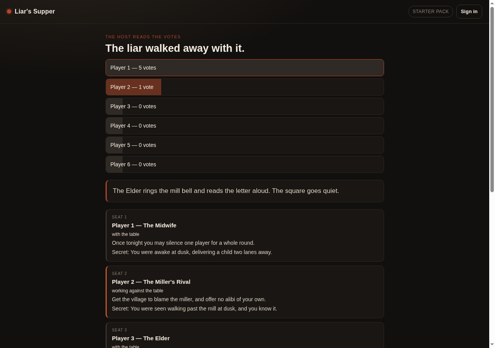

# Liar's Supper

A party deduction game for one phone passed around the table. An AI host deals
everyone a secret role, narrates three twists while the table argues on a timer,
then takes a private vote and reads out who the table decided to throw out.

Submission for quest [#15726 — Party deduction game with an AI host](https://github.com/pollinations/pollinations/issues/15726).

Live: https://xiaotian1171.github.io/liars-supper/



## Screens

| The briefing | Holding to read your role | The reveal |
| --- | --- | --- |
|  |  |  |

## What it is

One device, one table, four to twelve people. Nobody installs anything and
nobody needs an account except the host.

1. **Setup.** Pick the table size, the discussion timer, and the names of the
   people playing. Names are optional — the host numbers the seats if you skip
   them.
2. **Briefing.** The host sets the scene: where you are, what just happened, and
   what the table has to decide before the night is over.
3. **Deal.** The device goes around the table. Each player holds the screen to
   uncover their own role — a name, what they want, and one thing only they
   know — then lets go and passes the device on. Holding is what keeps the next
   player from seeing the last one's card.
4. **Rounds.** Three narrated twists, each with a countdown the table argues
   through. When the clock runs out the host chimes.
5. **Vote.** The device goes around again and every player points at a seat,
   privately.
6. **Reveal.** The host reads the tally, says whether the table caught a liar or
   handed the night to them, and reads out the roles people were hiding.

Roles are social: they tell you what to want and what you know, and the table
enforces it. The app counts votes and keeps score; it does not police what
anyone says out loud.

## Two ways to run the table

**Signed out — the starter pack.** Three complete scenarios ship in `pack.js`
(The Midnight Ferry, Closing Night at the Vine, The Village of Ash), each with
its own premise, three twists, three liar roles and six table roles. Narration
runs through the device's own voice. Nothing is sent anywhere, so a table with
no account and no signal can still play a full game.

**Signed in — the host writes the night.** With a Pollinations key the host
writes a fresh scenario for your exact table size before every game, and narrates
with a Pollinations voice. If the host's scenario does not fit the table exactly
— one role per player, the right number of liars, at least three twists — it is
thrown away and the starter pack takes over, so a bad generation never blocks a
game.

## Why bring your own Pollen

The quest asks for the host to pay with their own Pollen, so that is what the app
does: sign-in is the Pollinations authorization-code flow with PKCE, and the key
lives in `sessionStorage` for the tab only. Closing the tab signs you out. There
is no server, no database, and no key of ours anywhere in the page.

The wallet chip in the header is display only. Running out of Pollen does not
break a game — the app falls back to the starter pack and the device voice.

## Running it

It is three files and no build step. Any static server works:

```bash
python3 -m http.server 8080
# open http://localhost:8080/
```

Opening `index.html` straight from disk works too, except that the OAuth
redirect needs a real origin — signed-out play is unaffected.

## Tests

```bash
node test.mjs
```

168 checks over the parts that break quietly: how many liars each table size
hides, that a deal never repeats or drops a role and always fills the table,
that a host-written scenario is rejected unless it fits exactly, that JSON
wrapped in prose or code fences is still read, that votes are counted per seat
and a tie never counts as a catch, and the clock formatting.

## How it talks to Pollinations

- Scenario: `POST gen.pollinations.ai/v1/chat/completions`, model chosen from
  `GET gen.pollinations.ai/text/models` (the picker only offers models with
  `supported_endpoints` covering chat completions). The reply is asked for as
  JSON and validated before it is dealt.
- Narration: `POST gen.pollinations.ai/v1/audio/speech` with a voice from
  `GET gen.pollinations.ai/audio/models` — the picker only lists models whose
  `supported_endpoints` include `/v1/audio/speech`, and the voice list comes from
  the chosen model's own `voices` field.
- Both are called with the player's own key as `Authorization: Bearer …`, and
  only after they sign in.

## What is stored

Names, table size, timer and the two model choices go to `localStorage` so the
next game is one tap away. The access token and the PKCE verifier live in
`sessionStorage` and die with the tab. Nothing about a game — roles, votes,
tally — leaves the device.

## Cost

A signed-in game is one scenario call plus one narration call per spoken line
(briefing, three twists, the reveal), so a full night is a handful of calls on
the host's own Pollen. Signed-out play costs nothing at all.

## Known limits

- Roles are enforced by the table, not by the app. That is the genre, not a bug.
- One device only. Passing the phone is the point; there is no multi-phone join.
- The starter pack is deliberately small — three scenarios, so the same table
  does not see the same night twice in a row. Sign in for fresh ones.

## Verified

Walked end to end in a real browser (Chrome on a cloud desktop, 2026-10-03),
from the deployed page: opened the app, set a six-player table, opened the night,
dealt six roles and held the panel to reveal one of them (and watched it hide
again on release), played all three twists through the timer, voted around the
table, read the reveal and its tally, and started a second night with a fresh
scenario. Every screen was asserted visible when it should be, and the console
was empty of errors — the screenshots above are from that run.

## License

MIT — see `LICENSE`.
